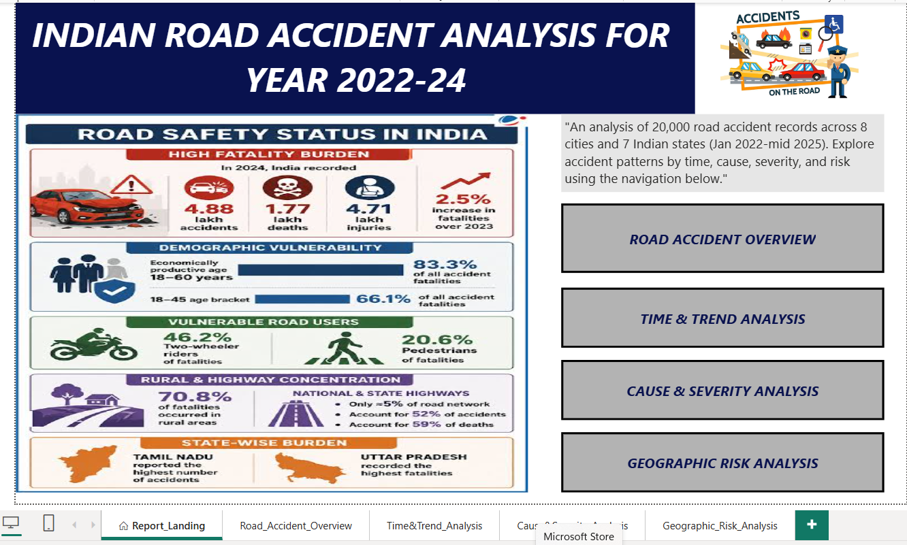
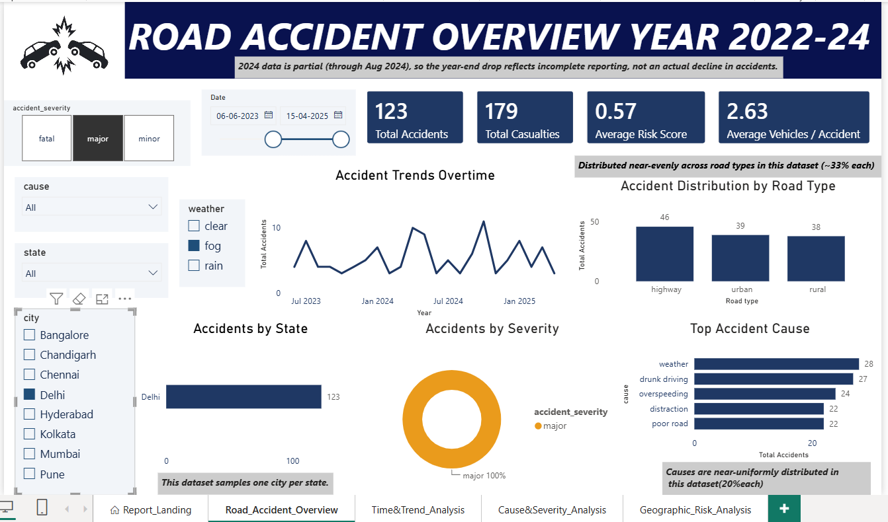
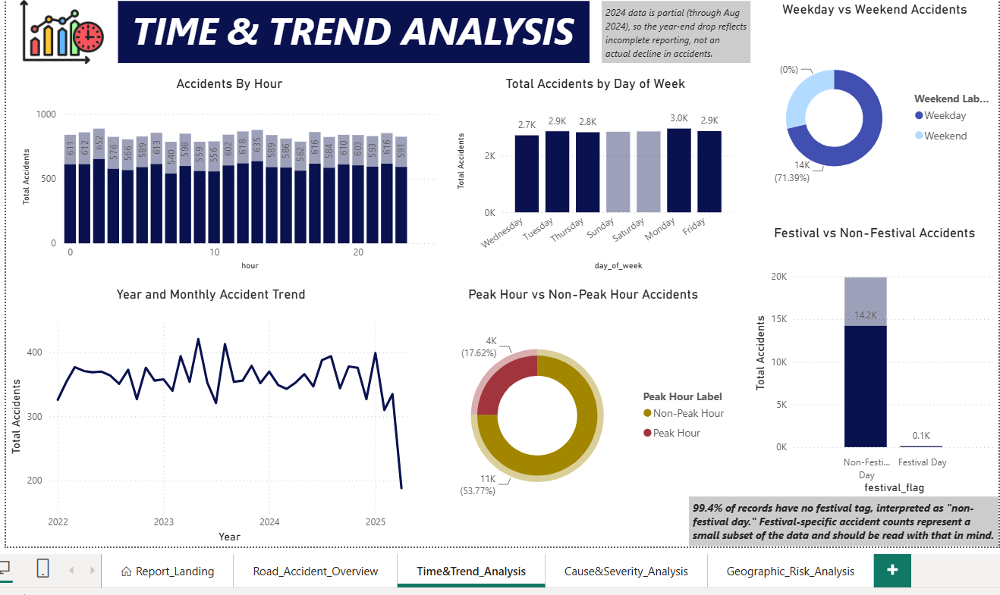
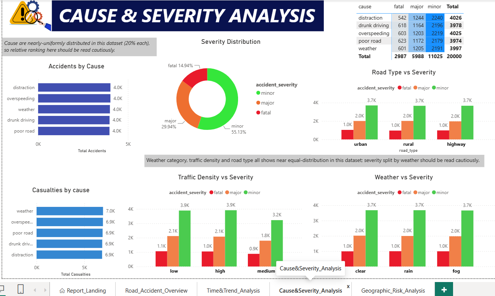
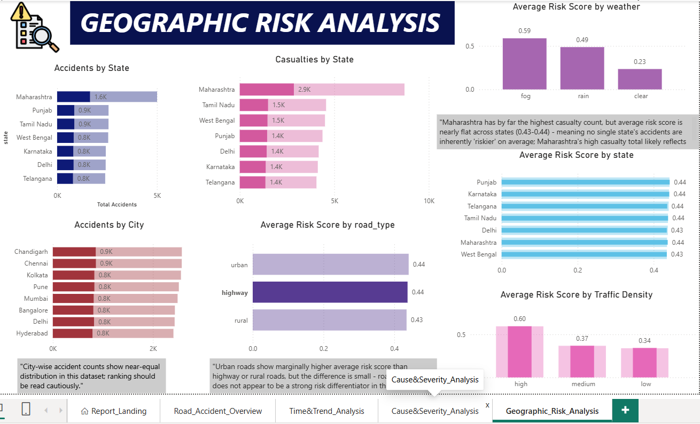

# Road Accident Analysis Dashboard (India)

An interactive **Power BI** dashboard and exploratory analysis of ~20,000 road accident records across 8 cities in 7 Indian states (January 2022 - mid 2025).

> **Note on the data:** The dataset is a **synthetic Kaggle dataset**. Most categorical columns (cause, road type, weather, city, day of week) are close to uniformly distributed, so the findings demonstrate an analytical workflow and should not be read as real-world road-safety conclusions.

---

## Screenshots

**Home**



**Overview**



**Time & Trend Analysis**



**Cause & Severity Analysis**



**Geographic Risk Analysis**



---

## Objectives

- Explore accident patterns by city, state, time period, cause, road type, and weather.
- Compare three distinct measures, **accident count**, **casualties**, and **risk score**, and show how each tells a different story.
- Build an interactive dashboard that lets users filter and drill down into the data.
- Test whether accident severity can be predicted from the available features.

## Dataset

| Detail | Value |
|---|---|
| Source | Kaggle (synthetic dataset) |
| Records | ~20,000 |
| Coverage | 8 cities, 7 Indian states |
| Period | January 2022 - mid 2025 (2025 is a partial year) |
| Key columns | cause, road_type, weather, city, day_of_week, casualties, risk_score, [add others] |

## Tools & Technologies

- **Microsoft Power BI Desktop:** dashboards, DAX measures
- **Power Query:** data cleaning and transformation
- **Python (pandas, scikit-learn):** data processing and modeling
- **Excel:** supporting workbooks

## Dashboard Overview

The dashboard has 5 pages:

1. **Home:** Navigation and project summary.
2. **Overview:** Headline KPIs (total accidents, casualties, average risk score) with a high-level summary of accidents across cities, causes, and time.
3. **Time & Trend Analysis:** Accident count and casualties over time by year, month, and day of week, with a note on the partial 2025 data.
4. **Cause & Severity Analysis:** Breaks accidents down by cause, road type, and weather to compare how each relates to accident severity and casualties.
5. **Geographic Risk Analysis:** Compares cities and states by accident count, casualties, and risk score, showing how the three measures rank locations differently.

Each page includes slicers, and visuals cross-filter one another.

## Key Observations

The data is synthetic, differences between categories are generally small, and the dashboard notes flag partial years and small subsets.

## Predictive Modeling

I tested whether accident severity could be predicted using **Logistic Regression** and **Random Forest** (scikit-learn), with **macro F1** as the primary metric.

- `casualties` and `risk_score` were **excluded from the features** after identifying them as a **data leakage** risk, since they are closely tied to the outcome being predicted.
- With the leaky features removed, both models performed **close to the random-guessing baseline**.
- This is consistent with the synthetic nature of the data, which contains little learnable signal, and it shows the value of checking for leakage before trusting a high score.

## Repository Structure

```
road-accident-analysis/
├── dashboard/
│   └── road_accident_dashboard.pbix
├── data/
│   └── [dataset from Kaggle]
├── screenshots/
│   ├── 01-IndianaccidentHomepage.png
    |-- 02-Dashboard-Overview.png
    |-- 03-Dashboard-Time&TrendAnalysis.png
    |-- 04-Dashboard-Cause&severityanalysis.png
│   └── 05-Dashboard-geographicriskanalysis.png
└── README.md
```

## How to Use

1. Download the `.pbix` file from the `dashboard/` folder.
2. Open it in **Power BI Desktop** (free, Windows only).
3. If prompted, update the data source path to point to the dataset in `data/`.
4. Use the slicers on each page to filter by city, year, and other fields.

## Limitations

- Synthetic data, so results do not reflect real accident patterns.
- 2025 covers only part of the year, so year-on-year comparisons need care.
- Some subsets are small, so percentages within them can be unstable.

## Future Work

- Extend the analysis into a research paper.
- Repeat the workflow on a real accident dataset (for example, government open data).
- Publish the dashboard to the web and link it here.

## Author

**Anushka**
[LinkedIn](https://linkedin.com/in/anushka-dwivedi-15069933b) | [GitHub](https://github.com/anushkadwivedi908-a11y) | anushkadwivedi908@gmail.com
